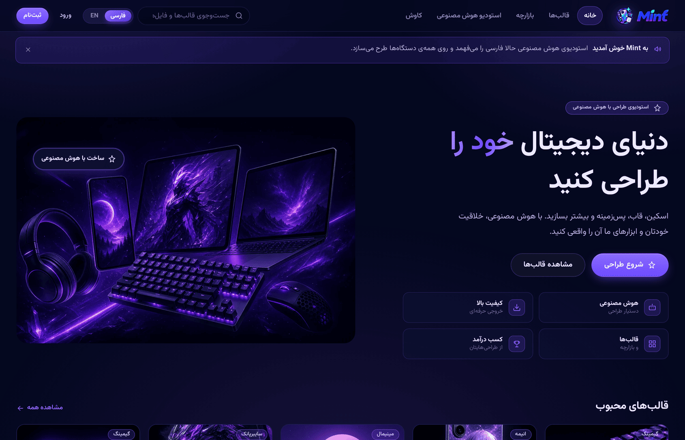
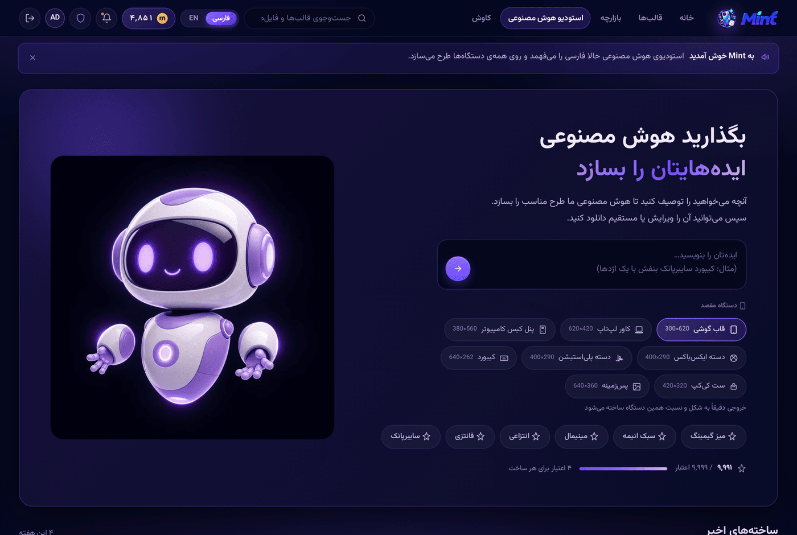
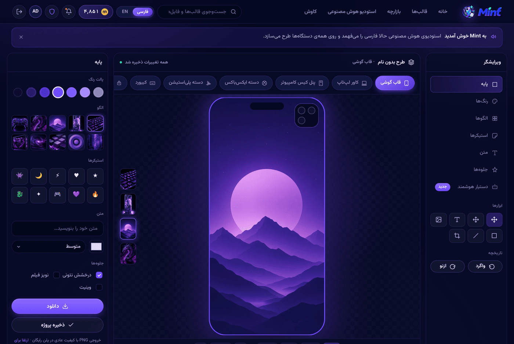
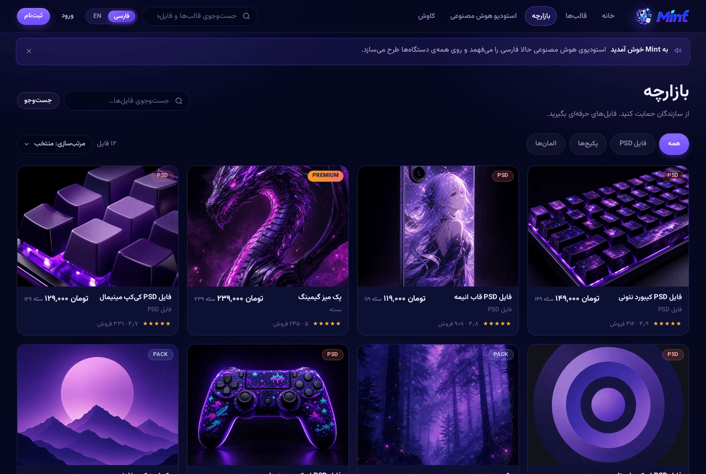
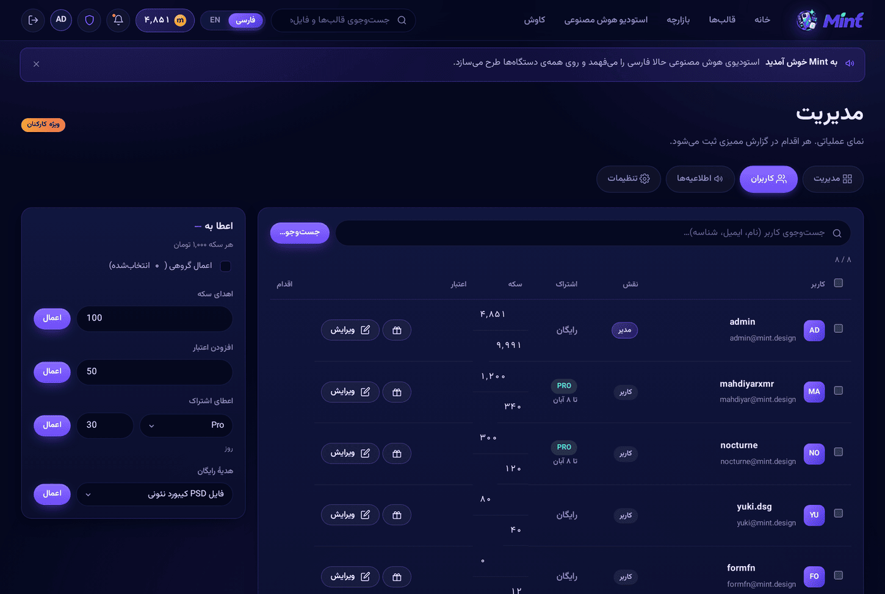
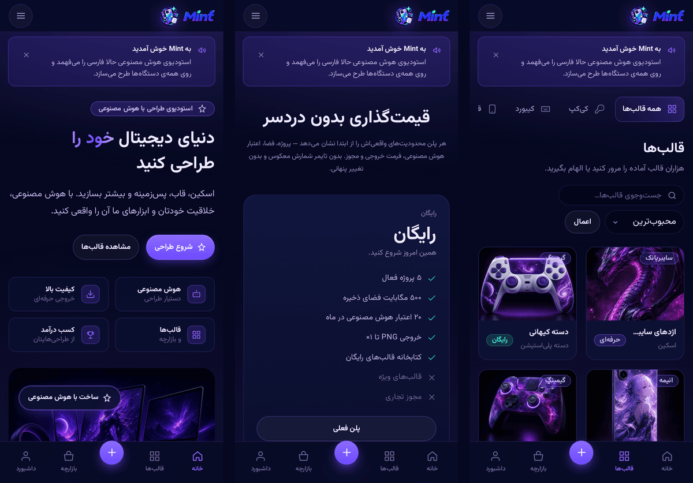

<div align="center">


**دنیای دیجیتال خود را طراحی کنید** · **Design your digital world**

پلتفرم فارسی‌محور ساخت اسکین، قاب و پس‌زمینه برای دستگاه‌ها، با تولید تصویر به کمک هوش مصنوعی
<br>
A Persian-first platform for designing device skins, cases and wallpapers, with AI image generation

<br>


<br>

### **[فارسی](#فارسی)**  ·  **[English](#english)**

<br>



</div>

---

<a name="فارسی"></a>

<div dir="rtl" align="right">

# فارسی

## Mint چیست

Mint یک اپلیکیشن وب چندصفحه‌ای است که کاربر با یک جملهٔ فارسی، طرحی برای دستگاهش می‌سازد و فایل خروجی را **دقیقاً به شکل همان دستگاه** تحویل می‌گیرد.

سه چیز آن را از یک ابزار عمومی تولید تصویر جدا می‌کند:

| | ابزار عمومی هوش مصنوعی | Mint |
|---|---|---|
| خروجی | یک تصویر، معمولاً مربع | فایل با نسبت دقیق دستگاه مقصد |
| بعد از تولید | خودتان باید برش بزنید | ویرایشگر با پیش‌نمایش روی همان دستگاه |
| فارسی | می‌فهمد، ولی محصول انگلیسی است | فارسی زبان پیش‌فرض، راست‌چین کامل |
| دسترسی | کارت و اشتراک ارزی لازم دارد | بدون کلید API هم کار می‌کند |
| پرداخت | دلاری | تومان — سکه و اعتبار |

> ادعا نمی‌کنیم موتور تصویری ما از بهترین مدل‌های دنیا بهتر است — همان موتورها را می‌توان پشت Mint وصل کرد. تفاوت در چیزی است که **تحویل داده می‌شود**.

## اجرا

```bash
node server.js          # http://localhost:3000
```

همین. **هیچ چیزی برای نصب وجود ندارد.** روی ویندوز می‌توانید روی `start.bat` دوبار کلیک کنید؛ در لینوکس و مک `./start.sh`.

```bash
PORT=3100 node server.js    # تغییر پورت
```

تنها پیش‌نیاز **Node 18 یا بالاتر** است. ورود با `admin` / `admin123`.

در اولین اجرا، فایل `data/db.json` با هشت حساب نمونه ساخته می‌شود. برای بازگرداندن به حالت اولیه کافی است پاکش کنید.

## صفر وابستگی

`package.json` هیچ وابستگی‌ای ندارد؛ نه `node_modules`، نه لاک‌فایل، نه مرحلهٔ build.

این تصمیم عمدی است: نصب بسته‌ها پشت یک میرور پولی npm که اعتبارش تمام شده بود مدام شکست می‌خورد (`402 Payment Required`)، و یک ابزار طراحی نباید به‌خاطر در دسترس نبودن یک رجیستری غیرقابل‌اجرا شود.

| فایل | جایگزین | چه چیزی را پوشش می‌دهد |
|---|---|---|
| `lib/miniweb.js` (۳۸۵ خط) | `express` | زنجیرهٔ میان‌افزار، مسیرهای `:param`، پارس query و body، فایل استاتیک با ETag و ۳۰۴، متدهای `res` |
| `lib/miniejs.js` (۱۵۹ خط) | `ejs` | تگ‌های `<% %>`، `<%= %>`، `<%- %>`، `include()` نسبی، متغیرها به‌صورت نام ساده، کش کامپایل |

**روش اعتبارسنجی جایگزینی:** خروجی هر صفحه و هر API از نسخهٔ Express ضبط شد، پوشهٔ وابستگی‌ها حذف شد، و همان ۶۳ پاسخ دوباره ضبط گردید — **هر ۶۳ پاسخ بایت‌به‌بایت یکسان** بودند. تنها تفاوت اولیه این بود که Express روی ریدایرکت یک بدنهٔ کوتاه می‌فرستد؛ همان رفتار پیاده‌سازی شد.

## قابلیت‌ها

- **استودیوی هوش مصنوعی** — پرامپت فارسی، انتخاب دستگاه مقصد، سبک‌های آماده
- **ویرایشگر چنددستگاهی** — هشت سطح، لایه‌های رنگ و الگو و استیکر و متن، پیش‌نمایش زنده
- **تضمین شکل** — برش خروجی به نسبت دقیق دستگاه، در خود سرور
- **کاتالوگ و بازارچه** — ۱۳ دسته‌بندی، ۱۴ قالب، ۱۲ محصول
- **اقتصاد سکه و اعتبار** — همه‌چیز از پنل مدیریت زنده تغییر می‌کند
- **پنل مدیریت** — کاربران، اعطای سکه و پلن، اطلاعیهٔ سراسری، تنظیمات، تست اتصال
- **دو زبان کامل** — ۴۸۶ کلید ترجمه، یک‌به‌یک جفت‌شده، راست‌چین واقعی
- **وب‌اپ نصب‌شدنی** — روی گوشی نصب می‌شود و آفلاین کار می‌کند
- **گیمیفیکیشن** — سکه، اعتبار، امتیاز XP و مأموریت روزانه

## هشت سطح دستگاه

هر سطح ابعاد تولید خودش را دارد، تعریف‌شده در `lib/ai.js`:

| سطح | ابعاد تولید | سطح | ابعاد تولید |
|---|---|---|---|
| قاب گوشی | `768×1536` | دستهٔ PlayStation | `1024×768` |
| کاور لپ‌تاپ | `1280×864` | کیبورد | `1408×576` |
| پنل کیس | `896×1280` | ست کی‌کپ | `1024×1024` |
| دستهٔ Xbox | `1024×768` | پس‌زمینه | `1280×720` |

## چطور کار می‌کند

```
پرامپت فارسی
     │
     ▼
ترجمه و بازنویسی ── مدل زبانی → MyMemory → واژه‌نامهٔ آفلاین
     │
     ▼
ساخت پرامپت ────── افزودن سبک و راهنمای شکل دستگاه
     │
     ▼
تولید تصویر ────── یکی از پنج ارائه‌دهنده
     │
     ▼
تضمین شکل ─────── برش به نسبت دقیق دستگاه (lib/png.js)
     │
     ▼
ویرایشگر
```

### زنجیرهٔ ترجمه

مدل‌های انتشاری روی کپشن انگلیسی آموزش دیده‌اند، پس پرامپت فارسی اول ترجمه می‌شود. هر لایه در صورت شکست به لایهٔ بعدی می‌افتد:

| ترتیب | لایه | کلید لازم؟ | توضیح |
|---|---|---|---|
| ۱ | مدل زبانی سازگار با OpenAI | بله | بازنویسی می‌کند، نه صرفاً ترجمه |
| ۲ | MyMemory | خیر | حدود ۵٬۰۰۰ نویسه در روز |
| ۳ | واژه‌نامهٔ آفلاین | خیر | حدود ۱۱۰ واژهٔ حوزهٔ طراحی، همیشه در دسترس |

یک قید سخت کیفیت را تعیین می‌کند: **توکن‌های ابتدایی بر پرامپت تصویری غالب‌اند**، پس پاسخ به ۲۰ کلمه محدود می‌شود و `sanitizePrompt()` مستقل از مدل آن را اعمال می‌کند — مقدمه، گیومه، بلوک کد و متن اضافه را حذف می‌کند و پاسخی که هنوز فارسی است را رد می‌کند.

خطاها پنهان نمی‌مانند: اگر کلیدی رد شود، تست اتصال در پنل مدیریت علت را کنار مترجمی که واقعاً جواب داده نشان می‌دهد.

### تضمین شکل

`lib/png.js` بدون هیچ کتابخانهٔ گرافیکی کار می‌کند:

1. داده‌های فشردهٔ `IDAT` باز می‌شوند
2. فیلتر هر خط اسکن معکوس می‌شود
3. تصویر از مرکز به نسبت دقیق دستگاه برش می‌خورد
4. دوباره فشرده و به یک PNG سالم تبدیل می‌شود

**۷۹ تا ۱۱۳ میلی‌ثانیه** روی تصویر ۱۰۲۴×۱۰۲۴. فقط نوع رنگ ۲ و ۶ هشت‌بیتی و غیر-interlaced؛ هر چیز دیگری بدون تغییر عبور می‌کند. غیرفعال‌سازی با `MINT_AI_RESHAPE=0`.

### ارائه‌دهندگان تصویر

هر پنج مورد پیاده‌سازی شده‌اند و از پنل مدیریت و بدون راه‌اندازی دوباره عوض می‌شوند:

| ارائه‌دهنده | کلید | رعایت ابعاد | محدودیت عملی |
|---|---|---|---|
| `pollinations` | ندارد | خیر | پس از سهمیهٔ کم، پاسخ HTTP 402 |
| `cloudflare` | رایگان | بله | ۱۰٬۰۰۰ Neuron در روز، بدون کارت |
| `worker` | خودی | بله | نیازمند استقرار توسط خودتان (`tools/worker.js`) |
| `huggingface` | دارد | بله | حدود ۰٫۱۰ دلار اعتبار ماهانه |
| `openai` | دارد | بله | هر میزبان سازگار با OpenAI |

پیش‌فرض `pollinations` است چون بدون کلید بلافاصله کار می‌کند.

## اقتصاد

| مقدار | پیش‌فرض |
|---|---|
| ارزش هر سکه | ۱٬۰۰۰ تومان |
| هزینهٔ هر تصویر | ۴ اعتبار |
| وقتی اعتبار تمام شود | ۵ سکه |
| هدیهٔ ثبت‌نام | ۵۰ سکه + ۲۰ اعتبار |
| سقف نرخ | ۱۲ درخواست در دقیقه |
| حداکثر تصویر در هر درخواست | ۲ |

پلن‌ها: **۰** / **۱۹۹٬۰۰۰** / **۴۹۹٬۰۰۰** تومان. قیمت‌ها همیشه به تومان‌اند و در هر زبان با ارقام محلی همان زبان قالب‌بندی می‌شوند.

همهٔ این اعداد از پنل مدیریت زنده تغییر می‌کنند و بلافاصله اعمال می‌شوند.

## تصاویر

<div dir="ltr" align="center">

| استودیوی هوش مصنوعی | ویرایشگر |
|---|---|
|  |  |

| بازارچه | پنل مدیریت |
|---|---|
|  |  |



</div>

## ساختار پروژه

```
mint/
├── server.js              مسیرها، میان‌افزار، نگهبان‌ها — ۴۱ مسیر
├── lib/
│   ├── miniweb.js         جایگزین express
│   ├── miniejs.js         جایگزین ejs
│   ├── ai.js              ترجمه، تولید، تضمین شکل
│   ├── png.js             رمزگشایی و برش PNG، بدون وابستگی
│   ├── store.js           ذخیره‌سازی JSON، هش scrypt
│   └── config.js          پیکربندی زنده با ماسک‌کردن کلیدها
├── data/
│   ├── i18n.js            ۴۸۶ کلید در دو زبان
│   ├── devices.js         هشت سطح دستگاه
│   ├── catalog.js         دسته‌بندی، قالب، محصول، پلن
│   └── icons.js           ۷۲ آیکون تک‌مسیره
├── views/                 ۳۴ قالب EJS
├── public/
│   ├── css/mint.css       ۸۴۵ خط، بدون فریم‌ورک
│   ├── js/                mint · editor · ai · admin · pwa
│   ├── img/brand/         لوگو، فاوآیکون، آیکون maskable
│   ├── sw.js              سرویس‌ورکر
│   └── manifest.webmanifest
├── tools/                 qa · interact · mobile · pwa · worker
└── docs/media/            تصاویر این فایل
```

## پیکربندی

دو راه، با همین ترتیب اولویت: **پنل مدیریت** ← **متغیر محیطی** ← **پیش‌فرض**.

پنل مدیریت (`/admin?tab=settings`) روی پیکربندی زنده می‌نویسد؛ برای همه‌چیز به‌جز مقدارهای اولیه همین کافی است. برای متغیرهای محیطی `.env.example` را کپی کنید:

```bash
cp .env.example .env
```

کلیدهای محرمانه در پاسخ سرور ماسک می‌شوند (`••••••••1234`) و هرگز در HTML ظاهر نمی‌شوند. برای پاک‌کردن یک کلید از `__clear` استفاده کنید — فرستادن رشتهٔ خالی مقدار قبلی را دست‌نخورده می‌گذارد.

## آزمون

چهار هارنس، همه بدون وابستگی به‌جز Playwright:

```bash
pip install playwright && python -m playwright install chromium
node server.js &

python tools/qa.py        # ۱۸۰ بارگذاری صفحه، ۱۴۰ لینک، دو زبان، دسکتاپ و موبایل
python tools/interact.py  # ۶۵ ادعای تعاملی: ورود، ساخت، خرید، اعطای ادمین
python tools/mobile.py    # ۱۵۶ رندر روی سه گوشی: اسکرول، سرریز، لمس، اندازهٔ متن
python tools/pwa.py       # ۲۰ بررسی: ثبت worker، کش، رفتار آفلاین
```

هر چهار مورد امروز **صفر ایراد** گزارش می‌کنند. ممیزی موبایل در اجرای اول **۱٬۲۴۴** ایراد داشت؛ ریشهٔ بیشترشان دو چیز بود — ترک‌های `1fr` که زیر عرض محتوا کوچک نمی‌شوند، و استایل‌های inline که بریک‌پوینت نمی‌پذیرند.

> هارنس‌ها داده را تغییر می‌دهند. پس از اجرا `data/db.json` را پاک کنید تا به حالت اولیه برگردد.

## نصب روی گوشی

یک قاعده تعیین‌کننده است: **سرویس‌ورکر فقط در بستر امن اجرا می‌شود** — HTTPS یا `localhost`. باز کردن `http://192.168.x.x:3000` روی گوشی، سایت کامل و واکنش‌گرا را نشان می‌دهد ولی دکمهٔ نصب و حالت آفلاین ندارد.

سه راه:

1. **روی خود کامپیوتر** — `http://localhost:3000` بستر امن محسوب می‌شود
2. **گوشی با USB** — در `chrome://inspect/#devices` یک port-forward از `3000` بسازید؛ گوشی آن را `localhost` می‌بیند
3. **تونل** — `cloudflared tunnel --url http://localhost:3000` یک آدرس HTTPS عمومی می‌دهد

`node server.js` هنگام اجرا آدرس شبکهٔ محلی و همین نکته را چاپ می‌کند.

## رفع اشکال

<details>
<summary><b>«Cannot find module 'express'»</b></summary>

نسخهٔ قدیمی را اجرا می‌کنید. نسخهٔ فعلی هیچ وابستگی‌ای ندارد؛ `git pull` کنید.
</details>

<details>
<summary><b>«npm error 402 Payment Required»</b></summary>

npm شما به یک میرور خصوصی و پولی اشاره می‌کند که اعتبارش تمام شده. **برای این پروژه اهمیتی ندارد** چون چیزی برای نصب نیست. برای پروژه‌های دیگر:

```bash
npm config get registry
npm config set registry https://registry.npmjs.org/
```
</details>

<details>
<summary><b>تصویری تولید نمی‌شود</b></summary>

سطح رایگان `pollinations` پس از سهمیهٔ کمی پاسخ `402` می‌دهد. از `/admin?tab=settings` ارائه‌دهنده را عوض کنید یا روی «تست اتصال» بزنید تا علت دقیق را ببینید.
</details>

<details>
<summary><b>دکمهٔ نصب ظاهر نمی‌شود</b></summary>

بستر امن نیست. بخش «نصب روی گوشی» بالا را ببینید.
</details>

<details>
<summary><b>پورت ۳۰۰۰ اشغال است</b></summary>

`PORT=3100 node server.js` — در ویندوز: `set PORT=3100 && npm start`
</details>

## وضعیت

| انجام‌شده | آمادهٔ اتصال | پیشنهاد |
|---|---|---|
| هستهٔ سایت، ۴۱ مسیر، ۳۴ نما | ترجمه با مدل زبانی (کلید لازم دارد) | دعوت دوستان و پاداش آن |
| تولید تصویر با پنج ارائه‌دهنده | Worker اختصاصی (باید مستقر شود) | درگاه پرداخت |
| تضمین شکل روی هشت سطح | | مزایای پلن Pro |
| اقتصاد سکه و اعتبار | | کمیسیون فروش در بازارچه |
| پنل مدیریت و اطلاعیه | | اپ موبایل، AR، سه‌بعدی |
| وب‌اپ نصب‌شدنی و آفلاین | | |
| صفر وابستگی npm | | |

## تیم

مهدی‌یار توکلی · محمدعلی شرهانی · عرفان درودی · متین عباس‌پور · محمدعلی جبلی · امیرپارسا درودی‌نژاد · قدم گاهی · اراس غلام‌رضایی

## مجوز

MIT — فایل [LICENSE](LICENSE) را ببینید.

</div>

---

<a name="english"></a>

# English

## What Mint is

Mint is a server-rendered, multi-page web app. A user writes one sentence in Persian, and gets back a design **shaped exactly for their device** — not a square image they have to crop.

Three things separate it from a general-purpose image tool:

| | General AI tool | Mint |
|---|---|---|
| Output | one image, usually square | a file at the target device's exact ratio |
| After generating | you crop and fit it yourself | an editor previewing on that device |
| Persian | understands it, but the product is English | Persian is the default, true RTL |
| Access | needs a card and a foreign subscription | works with no API key at all |
| Payment | dollars | Toman — coins and credits |

> We do not claim our image engine beats the best models in the world — those same engines can be plugged in behind Mint. The difference is in what gets **delivered**.

## Running it

```bash
node server.js          # http://localhost:3000
```

That is the whole setup. **There is nothing to install.** On Windows double-click `start.bat`; elsewhere run `./start.sh`.

```bash
PORT=3100 node server.js
```

Node 18 or newer is the only requirement. Sign in with `admin` / `admin123`.

The first run creates `data/db.json` with eight demo accounts. Delete it to reset to seed data.

## Zero dependencies

`package.json` lists no dependencies. There is no `node_modules`, no lockfile and no build step.

This is deliberate. Installs kept failing behind a paid npm mirror that had run out of credit (`402 Payment Required`), and a design tool should not become unrunnable because a registry is unreachable.

| File | Replaces | What it covers |
|---|---|---|
| `lib/miniweb.js` (385 lines) | `express` | middleware chain, `:param` routes, query and body parsing, static files with ETag/304, `res.render/json/send/redirect/status` |
| `lib/miniejs.js` (159 lines) | `ejs` | `<% %>`, `<%= %>`, `<%- %>`, `<%# %>`, `<%%`, whitespace control, `include()` relative to the including file, locals as bare identifiers, mtime-keyed compile cache |

**How the swap was verified:** every page and API response was captured from the running Express + EJS build, the dependency folder was deleted, and the same 63 responses were captured again — **all 63 came back byte-for-byte identical**. The only difference on the first pass was that Express writes a short body on a 302; `miniweb` now performs the same content negotiation.

## Features

- **AI Studio** — Persian prompt, target-device picker, preset styles
- **Multi-device editor** — eight surfaces, colour/pattern/sticker/text layers, live preview
- **Shape guarantee** — output cropped to the device's exact ratio, server-side
- **Catalogue and marketplace** — 13 categories, 14 templates, 12 products
- **Coin and credit economy** — every value editable live from the admin panel
- **Admin console** — users, grants, site-wide announcement, settings, connection test
- **Two complete languages** — 486 paired translation keys, true RTL
- **Installable web app** — installs on a phone and works offline
- **Gamification** — coins, credits, XP and daily quests

## Eight device surfaces

Each surface has its own generation size, defined in `lib/ai.js`:

| Surface | Size | Surface | Size |
|---|---|---|---|
| Phone case | `768×1536` | PlayStation controller | `1024×768` |
| Laptop cover | `1280×864` | Keyboard | `1408×576` |
| PC case panel | `896×1280` | Keycap set | `1024×1024` |
| Xbox controller | `1024×768` | Wallpaper | `1280×720` |

## How it works

```
Persian prompt
     │
     ▼
Translate / rewrite ── language model → MyMemory → offline glossary
     │
     ▼
Build prompt ───────── add style and a device shape hint
     │
     ▼
Generate ───────────── one of five providers
     │
     ▼
Shape guarantee ────── crop to the device ratio (lib/png.js)
     │
     ▼
Editor
```

### The translation chain

Diffusion models are captioned in English, so a Persian prompt is translated first. Each link falls through to the next on failure:

| Order | Link | Needs a key | Notes |
|---|---|---|---|
| 1 | OpenAI-compatible chat model | yes | rewrites rather than translates |
| 2 | MyMemory | no | ~5,000 characters/day |
| 3 | Offline glossary | no | ~110 design words, always available |

One constraint dominates quality: **early tokens dominate a diffusion prompt.** The reply is capped at 20 words, and `sanitizePrompt()` enforces it no matter what comes back — stripping preambles, quotes, code fences and trailing chatter, and rejecting any reply that still contains Persian.

Failures are surfaced, never swallowed. A rejected key shows its reason next to the translator that actually answered.

### The shape guarantee

`lib/png.js` works with no graphics library:

1. inflate the `IDAT` stream
2. undo each scanline's filter
3. centre-crop to the device's exact ratio
4. re-deflate into a valid PNG

**79–113 ms** on a 1024×1024 image. 8-bit colour types 2 and 6, non-interlaced only; anything else passes through untouched. Disable with `MINT_AI_RESHAPE=0`.

### Image providers

All five are implemented and swap from the admin panel with no restart:

| Provider | Key | Honours size | Practical limit |
|---|---|---|---|
| `pollinations` | none | no | HTTP 402 after a small quota |
| `cloudflare` | free | yes | 10,000 Neurons/day, no card |
| `worker` | your own | yes | you deploy it (`tools/worker.js`) |
| `huggingface` | yes | yes | ~$0.10 credit/month |
| `openai` | yes | yes | any OpenAI-compatible host |

`pollinations` is the default because it works immediately with no key.

## Economy

| Value | Default |
|---|---|
| Coin value | 1,000 Toman |
| Cost per image | 4 credits |
| When credits run out | 5 coins |
| Signup gift | 50 coins + 20 credits |
| Rate limit | 12 requests/minute |
| Max images per request | 2 |

Plans: **0** / **199,000** / **499,000** Toman. Prices are always in Toman and are formatted with each language's own numerals.

Every one of these is editable live from the admin panel and applies immediately.

## Screenshots

<div align="center">

| AI Studio | Editor |
|---|---|
|  |  |

| Marketplace | Admin |
|---|---|
|  |  |


</div>

## Project layout

```
mint/
├── server.js              routes, middleware, guards — 41 routes
├── lib/
│   ├── miniweb.js         the express replacement
│   ├── miniejs.js         the ejs replacement
│   ├── ai.js              translation, generation, shape guarantee
│   ├── png.js             dependency-free PNG decode and crop
│   ├── store.js           JSON-backed store, scrypt hashing
│   └── config.js          live config with secret masking
├── data/
│   ├── i18n.js            486 keys in two languages
│   ├── devices.js         the eight surfaces
│   ├── catalog.js         categories, templates, products, plans
│   └── icons.js           72 single-path icons
├── views/                 34 EJS templates
├── public/
│   ├── css/mint.css       845 lines, no framework
│   ├── js/                mint · editor · ai · admin · pwa
│   ├── img/brand/         logo, favicons, maskable icons
│   ├── sw.js              service worker
│   └── manifest.webmanifest
├── tools/                 qa · interact · mobile · pwa · worker
└── docs/media/            the images in this file
```

## Configuration

Two ways, in this precedence: **admin panel** → **environment variable** → **default**.

The admin panel (`/admin?tab=settings`) writes to live config and is enough for everything except initial values. For environment variables, copy `.env.example`:

```bash
cp .env.example .env
```

Secrets are masked in server responses (`••••••••1234`) and never appear in HTML. To clear one, use `__clear` — sending an empty string leaves the stored value untouched.

## Testing

Four harnesses. Nothing to install except Playwright:

```bash
pip install playwright && python -m playwright install chromium
node server.js &

python tools/qa.py        # 180 page loads, 140 links, two languages, desktop + mobile
python tools/interact.py  # 65 interaction assertions: login, generate, buy, admin grants
python tools/mobile.py    # 156 renders on three phones: scroll, overflow, tap size, font size
python tools/pwa.py       # 20 checks: worker registration, cache contents, offline behaviour
```

All four report **zero issues** today. The mobile audit found **1,244** faults on its first run; most traced back to two causes — `1fr` grid tracks that never shrink below their content, and inline styles that carry no media query.

> The harnesses mutate data. Delete `data/db.json` afterwards to restore seed state.

## Installing on a phone

One rule decides this: **a service worker only runs in a secure context** — HTTPS or `localhost`. Opening `http://192.168.x.x:3000` from a phone shows the complete responsive site, but no install button and no offline mode.

Three ways to get one:

1. **On the computer itself** — `http://localhost:3000` counts as secure
2. **Phone over USB** — add a port-forward `3000 → localhost:3000` in `chrome://inspect/#devices`; the phone then sees `localhost`
3. **A tunnel** — `cloudflared tunnel --url http://localhost:3000` prints a public HTTPS address

`node server.js` prints the LAN address and this caveat on startup.

## Troubleshooting

<details>
<summary><b>"Cannot find module 'express'"</b></summary>

You are running an old revision. The current one has no dependencies — `git pull`.
</details>

<details>
<summary><b>"npm error 402 Payment Required"</b></summary>

Your npm points at a private paid mirror that has run out of credit. **It does not matter for this project** — there is nothing to install. For other projects:

```bash
npm config get registry
npm config set registry https://registry.npmjs.org/
```
</details>

<details>
<summary><b>No image is generated</b></summary>

The free `pollinations` tier answers `402` after a small quota. Switch provider in `/admin?tab=settings`, or press "Test connection" to see the exact reason.
</details>

<details>
<summary><b>The install button never appears</b></summary>

Not a secure context. See "Installing on a phone" above.
</details>

<details>
<summary><b>Port 3000 is taken</b></summary>

`PORT=3100 node server.js` — on Windows: `set PORT=3100 && npm start`
</details>

## Status

| Built | Ready to connect | Proposed |
|---|---|---|
| Core site, 41 routes, 34 views | Language-model translation (needs a key) | Referral rewards |
| Generation across five providers | Dedicated Worker (needs deploying) | Payment gateway |
| Shape guarantee on eight surfaces | | Pro plan entitlements |
| Coin and credit economy | | Marketplace seller commission |
| Admin console and announcements | | Mobile app, AR, 3D |
| Installable, offline-capable web app | | |
| Zero npm dependencies | | |

## Team

Mahdiyar Tavakoli · Mohammadali Sharhani · Erfan Doroudi · Matin Abbaspour · Mohammadali Jebeli · Amirparsa Doroudinejad · Ghadam Gahi · Aras Gholamrezaei

## License

MIT — see [LICENSE](LICENSE).

---

<div align="center">

**ایده‌ات را بگو، Mint می‌سازدش.** · **Say the idea, Mint builds it.**

</div>
